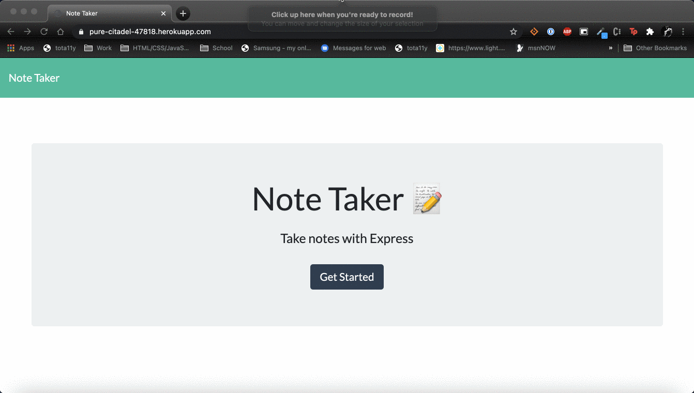

# Express.js: Note Taker

## Description

Modify starter code to create an application called Note Taker that can be used to write and save notes.

### Table of Contents

* [Installation](#installation)

* [Usage](#usage)

* [License](#license)

* [Questions](#questions)

## Installation

No installation required. Application is deployed to Heroku.

## Usage

## License

This project is licensed under the MIT License.
Click [Link](https://choosealicense.com/licenses/mit/) for more information.

## Questions

Juan Sanchez

[Github Profile](https://github.com/karizmatik215)

juan.sanchez@phila.gov